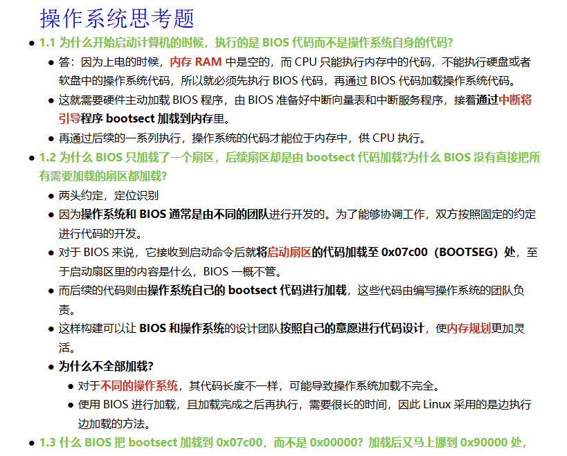
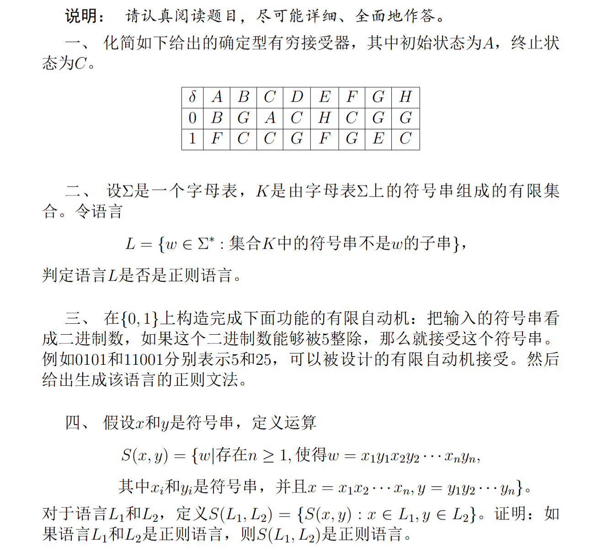
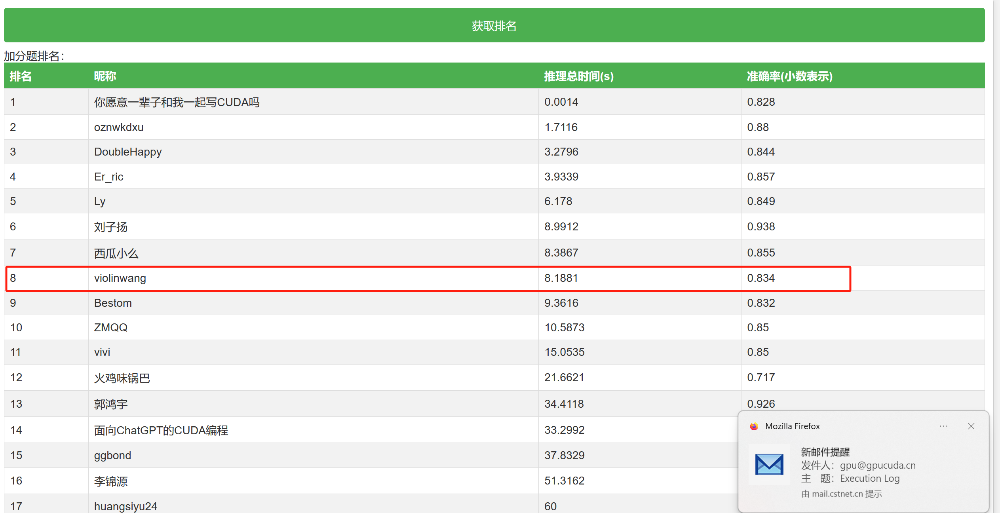
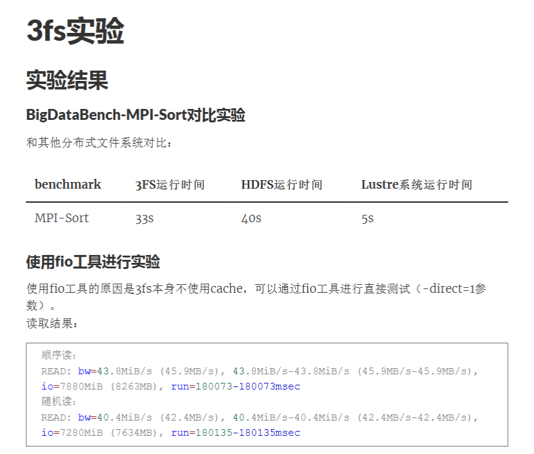

# UCAS_Course
UCAS Course List: OS, Algorithm, Formal Language, GPU etc. 中国科学院大学 计算机学院 

课程列表：
- 操作系统高级教程

- 算法设计
- 形式语言与自动机导论

- GPU编程

- 大数据系统与大规模数据分析
    - 同步图计算
    - Hadoop编程
    
- 高级数据管理
- 推荐系统
- 模式识别与机器学习
- 自然语言处理